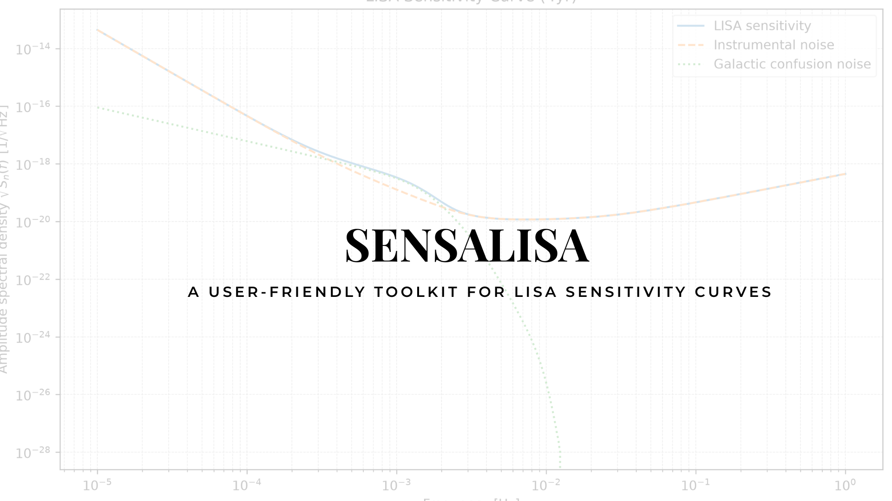

<p align="center">
  
</p>

<p align="center">


[](https://doi.org/10.5281/zenodo.21797858)

</p>

# SensaLisa

**SensaLisa** is a lightweight, user-friendly Python toolkit for generating and visualizing sensitivity curves for the **Laser Interferometer Space Antenna (LISA)**.

Designed for gravitational-wave researchers, students, and educators, SensaLisa provides an intuitive interface for computing and visualizing the LISA detector sensitivity with minimal setup while remaining flexible for scientific workflows.

---

# Features

- Generate LISA sensitivity curves with a single function call.
- Evaluate detector sensitivity directly at waveform frequencies.
- Publication-quality plotting utilities.
- Simple and intuitive Python API.
- Lightweight implementation with minimal dependencies.
- Modular design for integration into existing gravitational-wave analysis pipelines.

---

# Why SensaLisa?

Existing implementations of the LISA sensitivity model are often embedded within larger software packages or designed primarily for detector simulations.

SensaLisa focuses on providing a **clean, lightweight, and user-friendly interface** for generating and visualizing LISA sensitivity curves without unnecessary complexity.

Whether you are

- exploring detector performance,
- comparing waveform models,
- estimating signal-to-noise ratios,
- or preparing publication-quality figures,

SensaLisa enables these tasks in only a few lines of Python.

---

# Installation

Clone the repository

```bash
git clone https://github.com/BHUVANAKASHI/SensaLisa.git

cd SensaLisa
```

Install SensaLisa

```bash
python -m pip install -e .
```

Alternatively, install directly from GitHub

```bash
python -m pip install git+https://github.com/BHUVANAKASHI/SensaLisa.git
```

After publication on PyPI:

```bash
pip install SensaLisa
```

---

# Quick Start

Generate a standalone LISA sensitivity curve.

```python
from SensaLisa import LISASensitivity

lisa = LISASensitivity(
    observation_time="4yr"
)

frequencies, asd = lisa.get_asd()

lisa.plot()
```

Evaluate the detector sensitivity at waveform frequencies.

```python
import numpy as np

from SensaLisa import LISASensitivityFromWaveform

waveform_frequencies = np.logspace(-4, -1, 500)

lisa = LISASensitivityFromWaveform(
    frequencies=waveform_frequencies,
    observation_time="4yr"
)

frequencies, psd = lisa.get_psd()
```

---

# Main Classes

### `LISASensitivity`

Generates the LISA sensitivity curve over a logarithmically spaced frequency grid.

Ideal for

- detector visualization
- sensitivity studies
- publication figures

---

### `LISASensitivityFromWaveform`

Evaluates the LISA detector sensitivity directly at frequencies supplied by a waveform model.

Ideal for

- waveform comparisons
- matched-filter analyses
- signal-to-noise ratio calculations

---

# Examples and Tutorials

Example notebooks are available in the **examples/** directory.

They demonstrate

- generating standalone LISA sensitivity curves,
- evaluating sensitivity using waveform frequencies,
- plotting detector sensitivity,
- example workflows for gravitational-wave analysis.

---

# Repository Structure

```
SensaLisa/
│
├── src/
│   └── SensaLisa/
├── examples/
├── tests/
├── banner/
├── README.md
├── pyproject.toml
└── LICENSE
```

---

# Applications

SensaLisa is suitable for

- LISA sensitivity studies
- Signal-to-noise ratio calculations
- Gravitational-wave data analysis
- Detector performance visualization
- Scientific research
- Classroom demonstrations and tutorials

---

# Citation

If SensaLisa contributes to your research, please cite the repository.

```bibtex
@software{SensaLisa,
  author  = {Bhuvaneshwari Kashi},
  title   = {SensaLisa: A User-Friendly Toolkit for LISA Sensitivity Curves},
  year    = {2026},
  version = {0.1.0},
  url     = {https://github.com/BHUVANAKASHI/SensaLisa},
  note    = {Version 0.1.0}
}
```

---

# Acknowledgements

SensaLisa is inspired by and partially adapts components from the **LISA_Sensitivity** toolkit developed by the eXtreme Gravity Institute.

We gratefully acknowledge the original authors for their implementation of the LISA sensitivity model and their contributions to the gravitational-wave community.

SensaLisa extends this foundation by providing a streamlined, user-friendly interface, simplified workflows, and enhanced visualization tools for generating and exploring LISA sensitivity curves.

---

# References

- Robson, T., Cornish, N. J., & Liu, C. (2019). *The construction and use of LISA sensitivity curves*. Classical and Quantum Gravity, **36**, 105011.
- LISA_Sensitivity: https://github.com/eXtremeGravityInstitute/LISA_Sensitivity

---

# Contributing

Contributions, feature requests, bug reports, and suggestions are welcome.

Please open an Issue or submit a Pull Request.

---

# License

This project is distributed under the **MIT License**.
